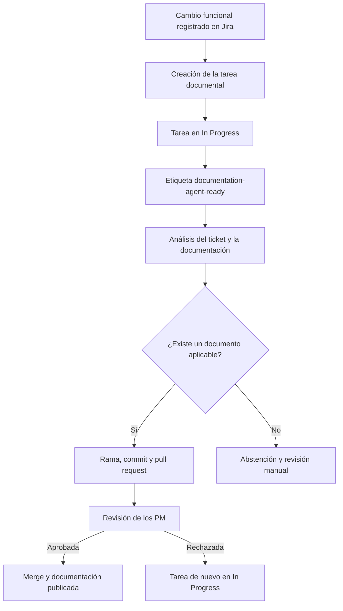

# Flujo del agente de documentación

## Objetivo

El agente convierte una necesidad documental registrada en Jira en una propuesta revisable en GitHub. Automatiza el análisis y la preparación del cambio, pero mantiene la decisión de publicación en manos de los PM.

## Flujo completo

## Funcionamiento actual

Cuando la tarea documental pasa a **In Progress**, una persona añade manualmente la etiqueta `documentation-agent-ready`.

La etiqueta inicia el workflow de GitHub Actions. El agente utiliza el ticket como evidencia de negocio, revisa la documentación existente y determina si hay un documento directamente relacionado que pueda actualizarse de forma inequívoca.

| Resultado del análisis | Acción automática | Decisión humana |
|---|---|---|
| Existe un documento aplicable | Crea una rama, realiza el cambio, genera un commit y abre una pull request | Un PM aprueba o rechaza la PR |
| No existe un documento aplicable | Registra una abstención en Jira y no crea una PR | Se solicita revisión manual |
| El cambio es ambiguo o insuficiente | Registra una abstención en Jira y no crea una PR | Se aclara o completa el ticket |

## Controles

- Solo se modifica un documento Markdown existente y directamente relacionado.
- El agente no inventa comportamiento, evidencia ni contenido ausente en el ticket.
- El agente no crea documentos nuevos automáticamente.
- Una discrepancia con un snapshot se muestra como evidencia, pero el ticket validado sigue siendo la fuente de negocio para preparar la propuesta.
- El cambio se valida antes de crear la PR.
- El agente nunca aprueba ni fusiona la PR.
- Si no puede proponer un cambio seguro, se abstiene y solicita revisión manual.

## Responsabilidades

| Componente | Responsabilidad |
|---|---|
| Jira | Registrar la necesidad, iniciar el proceso y mostrar el resultado |
| GitHub Actions | Orquestar el análisis, la validación y la publicación de la propuesta |
| Gemini | Analizar el ticket y proponer un cambio documental |
| Validador | Limitar el alcance y comprobar que la propuesta es segura y estructuralmente válida |
| PM | Revisar la pull request y decidir si se publica |

## Resultado esperado

El tiempo entre una necesidad de documentación y una propuesta revisable se reduce, mientras se conserva una aprobación humana explícita antes de publicar cualquier cambio.
