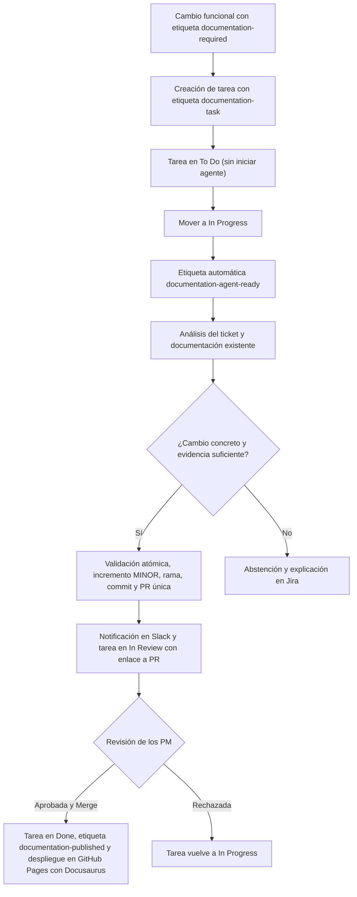

# Flujo del agente de documentación

## Objetivo

El agente convierte una necesidad documental registrada en Jira en una propuesta revisable en GitHub. Automatiza el análisis y la preparación del cambio, pero mantiene la decisión de publicación en manos de los PM.

## Flujo completo

## Funcionamiento actual

Cuando un ticket funcional requiere actualizar la documentación, se identifica mediante la etiqueta `documentation-required`. Jira crea una tarea documental con la etiqueta `documentation-task`.

La tarea permanece en **To Do** sin iniciar el agente. Cuando una persona la mueve a **In Progress**, Jira añade automáticamente la etiqueta `documentation-agent-ready`, la cual inicia el workflow del agente una única vez.

El agente utiliza el ticket de Jira como evidencia de negocio y analiza autónomamente toda la documentación existente. No es necesario indicar el nombre del documento, su ruta, el texto anterior ni el texto nuevo. Puede actualizar una o varias partes de un mismo documento y uno o varios documentos diferentes cuando todos estén claramente afectados.

Los archivos en `production-snapshots` son evidencia complementaria de solo lectura. Una discrepancia con un snapshot se reporta como evidencia, pero no impide generar una propuesta si el ticket contiene suficiente evidencia funcional.

| Resultado del análisis | Acción automática | Decisión humana |
|---|---|---|
| Propuesta válida | Python valida los cambios atómicamente, incrementa la versión MINOR de cada documento modificado, crea una única rama, un único commit y una única pull request, notifica en Slack y mueve la tarea en Jira a **In Review** registrando el enlace a la PR | Un PM aprueba o rechaza la PR |
| No existe documento, evidencia insuficiente o cambio ambiguo | Registra una abstención con el motivo en Jira y no crea rama, commit ni PR | Se aclara el ticket o se realiza revisión manual |

## Publicación y rechazo

- **Aprobación y Merge:** Si la PR es aprobada y se realiza el merge, Jira mueve la tarea a **Done**, añade la etiqueta `documentation-published` y GitHub Pages publica la nueva versión mediante Docusaurus.
- **Rechazo:** Si la PR se rechaza, Jira devuelve la tarea a **In Progress** para que pueda ser revisada.

## Controles

- Se pueden modificar uno o varios documentos Markdown existentes y directamente afectados. No se crean, eliminan ni renombran archivos.
- La operación es atómica: si falla la validación de un documento, no se publica parcialmente ningún cambio.
- El agente no inventa comportamiento, evidencia ni contenido ausente en el ticket.
- Una discrepancia con un snapshot se muestra como evidencia en el informe, pero el ticket validado es la fuente de negocio.
- El incremento de versión MINOR lo realiza código Python determinista sobre los documentos modificados.
- El build de Docusaurus valida que la documentación pueda publicarse correctamente.
- El agente nunca aprueba ni realiza el merge de la PR. La decisión final sigue siendo humana.
- Si no puede proponer un cambio seguro o suficiente, se abstiene y explica el motivo en Jira.

## Responsabilidades

| Componente | Responsabilidad |
|---|---|
| Jira | Registrar la necesidad, gestionar estados (*To Do*, *In Progress*, *In Review*, *Done*) y etiquetas (`documentation-required`, `documentation-task`, `documentation-agent-ready`, `documentation-published`) |
| GitHub Actions | Orquestar el análisis, la ejecución del agente, la validación y el flujo del PR |
| Gemini | Analizar el ticket y proponer los cambios documentales |
| Validador (Python) | Validar la propuesta de forma atómica e incrementar la versión MINOR de los documentos modificados |
| Slack | Notificar sobre propuestas pendientes de revisión |
| Docusaurus | Validar la construcción del sitio y publicar la documentación en GitHub Pages tras el merge |
| PM | Revisar la pull request y decidir la aprobación o rechazo final |

## Resultado esperado

El tiempo entre una necesidad de documentación y una propuesta revisable se reduce, garantizando la consistencia end-to-end y conservando la aprobación humana explícita antes de publicar cualquier cambio en producción.