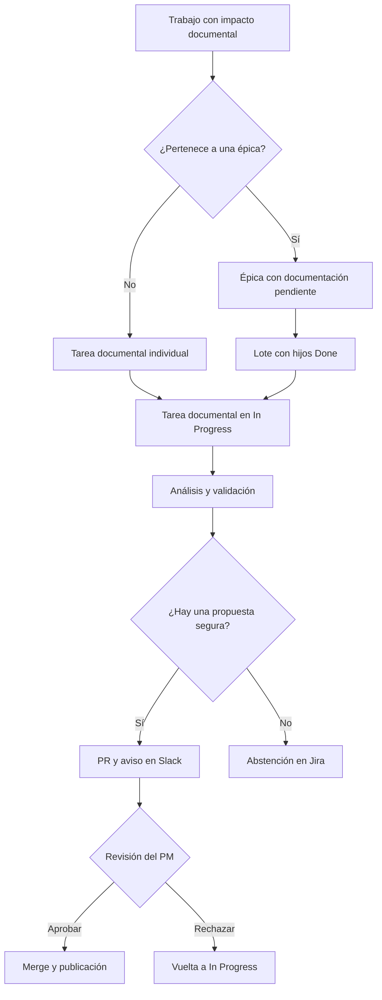

# Flujo del agente de documentación

## Objetivo

El agente convierte una necesidad documental registrada en Jira en una propuesta revisable en GitHub. Puede procesar un ticket independiente o agrupar varios hijos finalizados de una épica. Automatiza el análisis, el versionado y la preparación del cambio, pero mantiene la decisión de publicación en manos de los PM.

## Flujo completo



## Registro del impacto documental

La etiqueta `documentation-required` identifica un trabajo con impacto documental. Su comportamiento depende de la jerarquía del ticket:

| Contexto | Comportamiento |
|---|---|
| Ticket sin padre | Jira crea una tarea documental individual |
| Story, Task o Bug hijo directo de una épica | Jira no crea una tarea individual y añade `documentation-epic-pending` a la épica |

Las subtareas situadas bajo una Story, Task o Bug quedan fuera del alcance inicial del flujo por épicas.

## Actualizaciones documentales por épica

Una épica puede generar varios lotes documentales sin esperar a que finalicen todos sus hijos:

1. Los hijos con impacto reciben `documentation-required`.
2. La épica recibe `documentation-epic-pending`.
3. Un PM solicita un lote añadiendo `documentation-scope-ready` a la épica.
4. Jira añade temporalmente `documentation-batch-processing` para evitar ejecuciones simultáneas.
5. Jira selecciona los hijos directos que están en la categoría **Done**, contienen `documentation-required` y todavía no contienen `documentation-batched`.
6. Jira crea una única tarea documental con el contexto de la épica y la información de todos los hijos seleccionados.
7. Los hijos utilizados reciben `documentation-batched` y quedan relacionados con el lote.
8. Una regla de reconciliación elimina las etiquetas temporales. Si quedan hijos requeridos sin incluir, la épica conserva `documentation-epic-pending`; si no queda ninguno, la etiqueta se elimina.

Cuando finalicen más hijos, el PM puede volver a solicitar otro lote. Los hijos ya marcados con `documentation-batched` no vuelven a incluirse.

### Selección de los hijos

La selección utiliza el equivalente a esta consulta:

```jql
parent = EPIC-123
AND labels = documentation-required
AND labels NOT IN (documentation-batched)
AND statusCategory = Done
```

Se usa la categoría `Done` para admitir diferentes nombres de estados finales.

## Activación del agente

Las tareas documentales se crean en **To Do** con `documentation-task`. Cuando una persona las mueve a **In Progress**, Jira añade `documentation-agent-ready`.

La combinación de `documentation-task` y `documentation-agent-ready`, junto con la ausencia de `documentation-agent-started`, inicia el workflow de GitHub Actions. La marca `documentation-agent-started` evita ejecuciones duplicadas.

El agente utiliza la descripción de la tarea como evidencia de negocio. En los lotes de épica, esta descripción contiene el contexto de la épica y de todos los hijos incluidos.

## Análisis y propuesta

Gemini inspecciona la documentación pública Markdown dentro de `docs/` y determina qué contenido existente está afectado. Puede proponer cambios sobre una o varias secciones de uno o varios documentos, conservando el contenido que no esté relacionado con el ticket.

La propuesta se aplica de forma transaccional: si falla la validación de cualquier documento, no se publica ningún cambio parcial. El código determinista preserva el frontmatter e incrementa la versión MINOR de cada documento afectado.

| Resultado del análisis | Acción automática | Decisión humana |
|---|---|---|
| Existe documentación aplicable | Crea una rama, realiza los cambios validados, genera un commit y abre una única pull request | Un PM aprueba, modifica o rechaza la PR |
| No existe un documento aplicable | Registra una abstención en Jira y no crea una PR | Se solicita revisión manual |
| El cambio es ambiguo o insuficiente | Registra una abstención en Jira y no crea una PR | Se aclara o completa el ticket |

## Revisión, notificación y publicación

Cuando se crea una PR nueva:

- Jira mueve la tarea documental a **In Review** y añade `documentation-in-review`.
- Jira publica un comentario con el enlace a la PR.
- Slack notifica al PM responsable de que existe una aprobación pendiente.
- Una reejecución que reutiliza una PR existente no envía otra notificación a Slack.

Si el PM aprueba y fusiona la PR, la tarea pasa a **Done**, recibe `documentation-published` y GitHub Pages despliega el Centro de Ayuda con Docusaurus.

Si el PM rechaza la PR, la tarea vuelve a **In Progress** y recibe `documentation-rejected`. En un lote de épica, los hijos conservan `documentation-batched` porque continúan asociados a esa tarea y no deben entrar en un segundo lote mientras se corrige el primero.

Si un lote se cancela definitivamente, debe realizarse una operación manual y trazable que retire `documentation-batched` de sus hijos para que puedan seleccionarse de nuevo.

## Etiquetas de control

| Etiqueta | Se aplica en | Función |
|---|---|---|
| `documentation-required` | Ticket funcional | Declara impacto documental |
| `documentation-epic-pending` | Épica | Indica que existen hijos pendientes de agrupar |
| `documentation-scope-ready` | Épica | Solicita crear el siguiente lote |
| `documentation-batch-processing` | Épica | Evita crear lotes simultáneos o duplicados |
| `documentation-batched` | Hijo de épica | Registra que el hijo ya pertenece a un lote |
| `documentation-task` | Tarea documental | Identifica la tarea que contiene la evidencia para el agente |
| `documentation-agent-ready` | Tarea documental | Autoriza el inicio del agente |
| `documentation-agent-started` | Tarea documental | Evita ejecuciones repetidas |
| `documentation-in-review` | Tarea documental | Indica que existe una PR pendiente |
| `documentation-rejected` | Tarea documental | Registra el rechazo de la propuesta |
| `documentation-published` | Tarea documental | Registra que la propuesta fue fusionada y publicada |

## Controles

- Solo se modifican documentos Markdown existentes y directamente relacionados dentro de `docs/`.
- Una propuesta puede afectar a varios documentos, pero todos los cambios deben estar justificados por la evidencia del ticket.
- El agente no inventa comportamiento, evidencia ni contenido ausente en el ticket.
- El agente no crea documentos nuevos automáticamente.
- `project-docs/`, workflows, scripts, prompts y otros archivos fuera de `docs/` quedan fuera del alcance del agente.
- El frontmatter se conserva y el versionado lo aplica código determinista, no Gemini.
- Las rutas, los cambios no declarados, los symlinks y el contenido propuesto se validan antes de crear la PR.
- La aplicación multidocumento es atómica y revierte completamente ante cualquier error.
- El agente nunca aprueba ni fusiona la PR.
- Si no puede proponer un cambio seguro, se abstiene y solicita revisión manual.

## Responsabilidades

| Componente | Responsabilidad |
|---|---|
| Jira | Registrar la necesidad, iniciar el proceso y mostrar el resultado |
| GitHub Actions | Orquestar el análisis, la validación y la publicación de la propuesta |
| Gemini | Analizar la evidencia y proponer los cuerpos documentales afectados |
| Validador | Limitar el alcance, aplicar el versionado y comprobar que la propuesta multidocumento es segura y atómica |
| Slack | Avisar de una nueva PR que requiere aprobación |
| Docusaurus y GitHub Pages | Construir y publicar el Centro de Ayuda después del merge |
| PM | Revisar la pull request y decidir si se publica |

## Resultado esperado

El flujo permite documentar cambios independientes y épicas de forma incremental. Cada lote reúne únicamente trabajo finalizado y todavía no procesado, produce una propuesta trazable y mantiene una aprobación humana explícita antes de publicar cualquier cambio.
