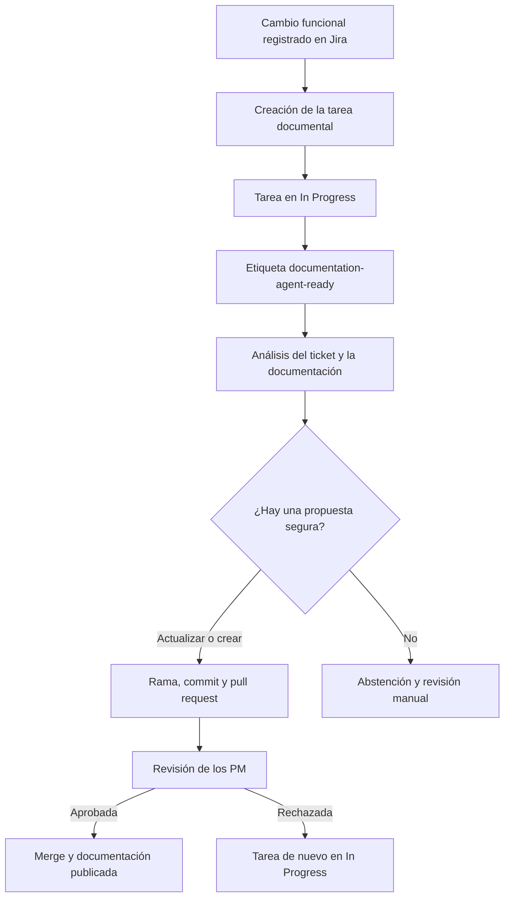

# Flujo del agente de documentación

## Objetivo

El agente convierte una necesidad documental registrada en Jira en una propuesta revisable en GitHub. Automatiza el análisis y la preparación del cambio, pero mantiene la decisión de publicación en manos de los PM.

## Flujo completo


```mermaid
flowchart TD
    A["Cambio funcional registrado en Jira"] --> B["Creación de la tarea documental"]
    B --> C["Tarea en In Progress"]
    C --> D["Etiqueta documentation-agent-ready"]
    D --> E["Análisis del ticket y la documentación"]
    E --> F{"¿Hay una propuesta segura?"}
    F -->|Actualizar o crear| G["Rama, commit y pull request"]
    F -->|No| H["Abstención y revisión manual"]
    G --> I["Revisión de los PM"]
    I -->|Aprobada| J["Merge y documentación publicada"]
    I -->|Rechazada| K["Tarea de nuevo en In Progress"]
```

## Obtención del contexto de Jira

Las tareas funcionales relevantes llevan la etiqueta `documentation-required` y se completan en **Done**. Al añadir `documentation-scope-ready` a la épica, Jira crea una sola tarea documental con `documentation-task`. El proyecto documental puede centralizar solicitudes de distintos proyectos y equipos: la tarea documental no necesita ser hija de la épica ni compartir su prefijo.

El flujo normal acepta `jira_epic_key` y `jira_task_keys` como referencias estructuradas, dejando `issue_description` libre para títulos, enlaces y contexto de los PM. Ejemplo de payload de `workflow_dispatch`:

```json
{
  "ref": "main",
  "inputs": {
    "issue_key": "DOC-999",
    "issue_summary": "Documentar las invitaciones",
    "issue_description": "# Contexto para PM\nRevisar invitaciones y permisos.\n[Diseño](https://example.invalid/diseno)",
    "jira_epic_key": "APP-123",
    "jira_task_keys": "APP-124, TEAM-125",
    "diagnose_only": "false"
  }
}
```

Ambos inputs deben llegar juntos. La épica debe ser una única clave; las tareas se separan por comas, aceptando espacios alrededor de ellas. Se rechazan elementos vacíos, claves inválidas y duplicados antes de consultar Jira o Claude. El contrato de claves es `[A-Z][A-Z0-9]*(?:-[A-Z0-9]+)*-[1-9][0-9]*`; no se recortan espacios alrededor de la clave de épica. Un input estructurado inválido nunca activa el parser del manifiesto como alternativa.

Sin ninguno de los dos inputs, se conserva el mecanismo anterior: la descripción puede contener únicamente este manifiesto estricto:

```yaml
DOCUMENTATION_SOURCE_V1
EPIC_KEY: DOC-123
TASK_KEYS:
- DOC-124
- DOC-125
```

Cuando la tarea documental pasa a **In Progress**, el workflow recupera desde Jira Cloud la épica y las tareas de las referencias estructuradas o del manifiesto. Antes de usar el contenido, comprueba que la fuente principal es una épica y que cada tarea funcional es hija directa, conserva `documentation-required` y pertenece a la categoría Done. Las claves pueden tener prefijos diferentes; la relación se valida con el campo `parent` de Jira, sin consultar ni exigir parentesco a la tarea documental.

En modo estructurado, `ticket.issue_description` se compone en este orden: `Documentation task CLAVE: RESUMEN`, dos saltos de línea y la descripción humana original sin recortar; después `Epic CLAVE: RESUMEN` y la descripción completa de la épica convertida de ADF; después cada sección `Task CLAVE: RESUMEN` y su descripción completa convertida, en el orden de los inputs. Las secciones se unen con dos saltos de línea. Las secciones recuperadas de Jira mantienen la conversión existente y eliminan únicamente espacios exteriores. Todo el contexto, incluidos títulos, separadores y texto humano, tiene un límite de 60.000 caracteres; si se supera, falla sin truncar y antes de preparar la petición. En modo manifiesto, se conserva exactamente la composición anterior de épica y tareas, sin añadir el manifiesto como contexto humano.

El contexto permanece dentro del ticket no confiable que recibe `build_request`, con las instrucciones de seguridad existentes. El JSON del ticket conserva exactamente `issue_key`, `issue_summary` e `issue_description`: las referencias se validan por separado y llegan al generador mediante `--jira-epic-key` y `--jira-task-keys`. Los consumidores de publicación y notificación siguen recibiendo el ticket original de tres campos.

Los nodos `codeBlock` se convierten en bloques Markdown delimitados, concatenando sus nodos `text` en orden y conservando literalmente el contenido, los saltos de línea y los espacios. El delimitador usa más backticks que cualquier secuencia del contenido para conservar también Markdown pegado dentro del bloque. Este texto se trata como evidencia y no se ejecuta ni se interpreta como instrucciones operativas.

Tanto el diagnóstico como el flujo normal comprueban cada descripción antes de preparar la petición a Claude. Si el ADF contiene texto distinto de espacios en blanco y el Markdown convertido queda vacío, el flujo falla con un error de pérdida de texto que identifica solo la clave Jira afectada. Una descripción ausente, sin texto o formada únicamente por espacios en blanco se considera realmente vacía y no provoca ese error.

El acceso usa autenticación básica de Jira Cloud y estos Repository Secrets, configurados solo en el paso que ejecuta el agente: `JIRA_BASE_URL`, `JIRA_API_EMAIL` y `JIRA_API_TOKEN`. Sus valores no se registran ni se incorporan a la tarea documental.

Las tareas documentales antiguas que no contienen `DOCUMENTATION_SOURCE_V1` mantienen el flujo anterior. Si el manifiesto está presente, no hay alternativa: cualquier error de formato, configuración, consulta, relación o validación detiene el flujo antes de llamar a Claude.

### Diagnóstico manual del contexto

El workflow **Documentation agent PoC** permite comprobar desde **Actions > Run workflow** que las descripciones completas de Jira llegan a la petición final preparada para Claude, sin enviarla.

1. Seleccionar en **Use workflow from** la rama que se quiere diagnosticar. El job de diagnóstico hace checkout de esa referencia, captura su SHA y lo verifica antes de consultar Jira y después de preparar la petición. El flujo automático normal continúa usando `main`.
2. Rellenar estos campos y activar `diagnose_only`:

   | Campo | Valor en diagnóstico | Valor en flujo normal |
   |---|---|---|
   | `issue_key` | Clave de la tarea documental, por ejemplo `DOC-999`; obligatorio | Obligatorio, sin cambios |
   | `issue_summary` | Resumen de la tarea documental; obligatorio | Obligatorio, sin cambios |
   | `issue_description` | Contexto humano conservado completo; puede dejarse vacío si solo se quiere diagnosticar las fuentes | Obligatorio por validación del job, aunque el formulario lo muestre opcional; conserva el límite de 60.000 caracteres y las validaciones de texto |
   | `jira_epic_key` | Una clave de épica, por ejemplo `APP-123`; obligatorio cuando `diagnose_only=true` | Opcional, junto con `jira_task_keys` activa el modo estructurado |
   | `jira_task_keys` | Claves separadas por comas, por ejemplo `APP-124, TEAM-125`; obligatorio cuando `diagnose_only=true` | Opcional, junto con `jira_epic_key` activa el modo estructurado |
   | `diagnose_only` | `true` | `false` por defecto; los payloads antiguos sin referencias siguen siendo compatibles |

3. El paso **Serialize diagnostic ticket input** valida las referencias con `parse_jira_source_inputs`, igual que el flujo normal. Rechaza campos ausentes, elementos vacíos —incluidas comas iniciales, finales o consecutivas—, claves inválidas, duplicados y texto adicional antes de exponer credenciales o consultar Jira. Conserva la descripción humana en el ticket temporal, sin construir un manifiesto. Para comparar una ejecución normal, usar los mismos inputs, incluida la descripción.
4. El paso **Diagnose validated Jira context in the prepared request** recibe únicamente los tres secretos Jira indicados arriba. Consulta y valida la épica y las tareas hijas directas con las mismas funciones del flujo normal: tipo Epic, relación con la épica, etiqueta `documentation-required` y categoría Done. Convierte las descripciones ADF a Markdown y usa la misma composición de contexto humano, épica y tareas, sin truncarlo. Si el conjunto supera 60.000 caracteres, falla antes de construir la petición.
5. Lee `.github/prompts/documentation-agent-poc.md` y los documentos bajo `docs/` mediante las mismas funciones del flujo normal. Usa `build_request` con el mismo modelo, `max_tokens` y contrato. Deserializa el JSON del mensaje de usuario y compara exactamente `ticket.issue_description` con el contexto Jira consolidado.
6. Consultar el JSON del paso de diagnóstico en los logs. `contexts_match=true` confirma la coincidencia exacta. Si hay discrepancia, publica las métricas seguras con `contexts_match=false` y el paso termina con código de error. Un fallo de inputs, consulta, validación, lectura o SHA detiene el diagnóstico sin publicar el payload.

El job tiene únicamente `contents: read`, no persiste credenciales de Git y no recibe ni lee `ANTHROPIC_API_KEY`. Lee los inputs desde el archivo local del evento (`GITHUB_EVENT_PATH`), evitando que Actions muestre el resumen o la descripción como variables de entorno del paso. No llama al transporte HTTP de Claude ni ejecuta `generate_and_apply`. Tampoco modifica documentos, crea ramas, commits o PRs, ni envía notificaciones a Jira o Slack. Solo serializa el ticket original en el directorio temporal del runner; la petición completa permanece en memoria. No publica artefactos.

El informe usa listas explícitas de campos permitidos, también para los objetos anidados:

| Campo JSON | Contenido |
|---|---|
| `epic` | `key`, `adf_text_characters`, `adf_code_block_count`, `description_characters`, `description_sha256` |
| `tasks` | Lista ordenada con esos mismos cinco campos para cada tarea |
| `context` | `characters` y `sha256` del contexto Jira consolidado |
| `request_context` | `characters` y `sha256` de `ticket.issue_description` extraído del JSON del mensaje de usuario |
| `contexts_match` | Booleano de igualdad exacta entre los dos contextos |
| `documents_count` | Número de documentos incluidos en el JSON de la petición |
| `prompt_characters` | Longitud del prompt leído, antes de añadir las instrucciones del sistema de `build_request` |
| `user_message_characters` | Longitud del mensaje de usuario JSON serializado completo |
| `commit_sha` | SHA completo del commit verificado para el diagnóstico |

`adf_text_characters` suma las longitudes de todos los nodos `text` del ADF original, incluidos espacios y saltos de línea presentes en esos textos; no incluye sintaxis Markdown añadida durante la conversión. `adf_code_block_count` cuenta sus nodos `codeBlock`, también los vacíos. `description_characters` y `description_sha256` siguen midiendo el Markdown convertido completo, incluidos los delimitadores de código.

Todas las longitudes cuentan caracteres del texto Python, no bytes ni tokens; las huellas SHA-256 se calculan sobre su codificación UTF-8. No se registran estados o etiquetas arbitrarios, textos de descripciones, resúmenes, prompts, documentos, respuestas Jira ni credenciales. El informe tampoco contiene el payload completo.

## Funcionamiento del agente

Cuando una tarea con la etiqueta `documentation-task` pasa a **In Progress**, Jira añade automáticamente la etiqueta `documentation-agent-ready`.

La etiqueta inicia el workflow de GitHub Actions. El agente utiliza el ticket como evidencia de negocio, revisa la documentación existente y determina si debe actualizar artículos existentes, crear artículos nuevos dentro de categorías existentes del Centro de Ayuda o combinar ambas operaciones.

| Resultado del análisis | Acción automática | Decisión humana |
|---|---|---|
| Existe un documento aplicable | Propone actualizarlo y abre una única pull request para toda la propuesta | Un PM aprueba o rechaza la PR |
| No existe un documento aplicable, pero hay evidencia y categoría suficientes | Propone un artículo nuevo con metadatos deterministas y abre la misma pull request | Un PM aprueba o rechaza la PR |
| No puede decidir con seguridad entre crear o actualizar | Registra una abstención en Jira y no crea una PR | Se solicita revisión manual |
| El cambio es ambiguo o insuficiente | Registra una abstención en Jira y no crea una PR | Se aclara o completa el ticket |

## Controles

- El contexto consolidado recuperado de Jira se conserva completo, sin truncado ni resumen automático, hasta un máximo de 60.000 caracteres; si lo supera, el flujo se detiene antes de Claude.
- La propuesta puede crear o actualizar uno o varios documentos Markdown y se aplica de forma atómica.
- El agente no inventa comportamiento, evidencia ni contenido ausente en el ticket.
- Los documentos nuevos solo se ubican en categorías existentes de `docs/centro-de-ayuda/`; el código determinista genera su frontmatter, identificador y versión inicial `1.0`.
- Una discrepancia con un snapshot se muestra como evidencia, pero el ticket validado sigue siendo la fuente de negocio para preparar la propuesta.
- El cambio se valida antes de crear la PR.
- El agente nunca aprueba ni fusiona la PR.
- Si cualquier operación falla, se restauran las actualizaciones y se eliminan las creaciones de esa ejecución.
- Si no puede proponer un cambio seguro, se abstiene y solicita revisión manual.

## Responsabilidades

| Componente | Responsabilidad |
|---|---|
| Jira | Registrar la necesidad, iniciar el proceso y mostrar el resultado |
| GitHub Actions | Orquestar el análisis, la validación y la publicación de la propuesta |
| Claude | Analizar el ticket y proponer un cambio documental |
| Validador | Limitar el alcance y comprobar que la propuesta es segura y estructuralmente válida |
| PM | Revisar la pull request y decidir si se publica |

## Resultado esperado

El tiempo entre una necesidad de documentación y una propuesta revisable se reduce, mientras se conserva una aprobación humana explícita antes de publicar cualquier cambio.
