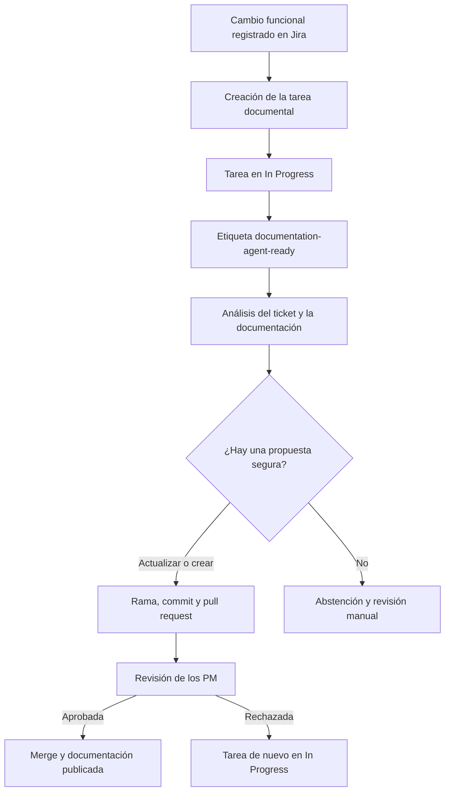

# Flujo del agente de documentación

## Objetivo

El agente convierte una necesidad documental registrada en Jira en una propuesta revisable en GitHub. Automatiza el análisis y la preparación del cambio, pero mantiene la decisión de publicación en manos de los PM.

## Flujo completo


```mermaid
flowchart TD
    A["Cambio funcional registrado en Jira"] --> B["Creación de la tarea documental"]
    B --> C["Tarea en In Progress"]
    C --> D["Etiqueta documentation-agent-ready"]
    D --> E["Análisis del ticket y la documentación"]
    E --> F{"¿Hay una propuesta segura?"}
    F -->|Actualizar o crear| G["Rama, commit y pull request"]
    F -->|No| H["Abstención y revisión manual"]
    G --> I["Revisión de los PM"]
    I -->|Aprobada| J["Merge y documentación publicada"]
    I -->|Rechazada| K["Tarea de nuevo en In Progress"]
```

## Obtención del contexto de Jira

Las tareas funcionales relevantes llevan la etiqueta `documentation-required` y se completan en **Done**. Al añadir `documentation-scope-ready` a la épica, Jira crea una sola tarea documental con `documentation-task`. Su descripción es corta y contiene únicamente este manifiesto:

```yaml
DOCUMENTATION_SOURCE_V1
EPIC_KEY: DOC-123
TASK_KEYS:
- DOC-124
- DOC-125
```

Cuando la tarea documental pasa a **In Progress**, el workflow recupera desde Jira Cloud la épica y las tareas del manifiesto. Antes de usar el contenido, comprueba que la fuente principal es una épica y que cada tarea es hija directa, conserva `documentation-required` y pertenece a la categoría Done. Convierte las descripciones ADF a texto Markdown legible y construye el contexto en el orden épica y tareas, siempre con su clave y resumen.

El acceso usa autenticación básica de Jira Cloud y estos Repository Secrets, configurados solo en el paso que ejecuta el agente: `JIRA_BASE_URL`, `JIRA_API_EMAIL` y `JIRA_API_TOKEN`. Sus valores no se registran ni se incorporan a la tarea documental.

Las tareas documentales antiguas que no contienen `DOCUMENTATION_SOURCE_V1` mantienen el flujo anterior. Si el manifiesto está presente, no hay alternativa: cualquier error de formato, configuración, consulta, relación o validación detiene el flujo antes de llamar a Claude.

### Diagnóstico manual del contexto

El workflow **Documentation agent PoC** permite comprobar desde **Actions > Run workflow** que Jira entrega completas las descripciones antes de llamar a Claude. Para hacerlo, se informan `issue_key`, `issue_summary` e `issue_description` con el manifiesto `DOCUMENTATION_SOURCE_V1` de la tarea documental y se activa `diagnose_only`.

Esta ejecución consulta y valida la épica y sus subtareas con el mismo flujo de producción, convierte las descripciones ADF a Markdown y construye el contexto consolidado. Termina entonces sin leer la clave de Anthropic, generar una propuesta, modificar documentos, crear una rama, hacer commit o abrir una pull request. Si `issue_description` no contiene `DOCUMENTATION_SOURCE_V1`, el diagnóstico falla.

El único resultado del comando es un JSON seguro con la clave de la épica; el estado, las etiquetas y la clave de cada subtarea; y las longitudes y huellas SHA-256 de cada descripción y del contexto consolidado. No muestra resúmenes, descripciones, prompts, tokens, secretos ni respuestas completas de Jira.

## Funcionamiento del agente

Cuando una tarea con la etiqueta `documentation-task` pasa a **In Progress**, Jira añade automáticamente la etiqueta `documentation-agent-ready`.

La etiqueta inicia el workflow de GitHub Actions. El agente utiliza el ticket como evidencia de negocio, revisa la documentación existente y determina si debe actualizar artículos existentes, crear artículos nuevos dentro de categorías existentes del Centro de Ayuda o combinar ambas operaciones.

| Resultado del análisis | Acción automática | Decisión humana |
|---|---|---|
| Existe un documento aplicable | Propone actualizarlo y abre una única pull request para toda la propuesta | Un PM aprueba o rechaza la PR |
| No existe un documento aplicable, pero hay evidencia y categoría suficientes | Propone un artículo nuevo con metadatos deterministas y abre la misma pull request | Un PM aprueba o rechaza la PR |
| No puede decidir con seguridad entre crear o actualizar | Registra una abstención en Jira y no crea una PR | Se solicita revisión manual |
| El cambio es ambiguo o insuficiente | Registra una abstención en Jira y no crea una PR | Se aclara o completa el ticket |

## Controles

- El contexto consolidado recuperado de Jira se conserva completo, sin truncado ni resumen automático, hasta un máximo de 60.000 caracteres; si lo supera, el flujo se detiene antes de Claude.
- La propuesta puede crear o actualizar uno o varios documentos Markdown y se aplica de forma atómica.
- El agente no inventa comportamiento, evidencia ni contenido ausente en el ticket.
- Los documentos nuevos solo se ubican en categorías existentes de `docs/centro-de-ayuda/`; el código determinista genera su frontmatter, identificador y versión inicial `1.0`.
- Una discrepancia con un snapshot se muestra como evidencia, pero el ticket validado sigue siendo la fuente de negocio para preparar la propuesta.
- El cambio se valida antes de crear la PR.
- El agente nunca aprueba ni fusiona la PR.
- Si cualquier operación falla, se restauran las actualizaciones y se eliminan las creaciones de esa ejecución.
- Si no puede proponer un cambio seguro, se abstiene y solicita revisión manual.

## Responsabilidades

| Componente | Responsabilidad |
|---|---|
| Jira | Registrar la necesidad, iniciar el proceso y mostrar el resultado |
| GitHub Actions | Orquestar el análisis, la validación y la publicación de la propuesta |
| Claude | Analizar el ticket y proponer un cambio documental |
| Validador | Limitar el alcance y comprobar que la propuesta es segura y estructuralmente válida |
| PM | Revisar la pull request y decidir si se publica |

## Resultado esperado

El tiempo entre una necesidad de documentación y una propuesta revisable se reduce, mientras se conserva una aprobación humana explícita antes de publicar cualquier cambio.
